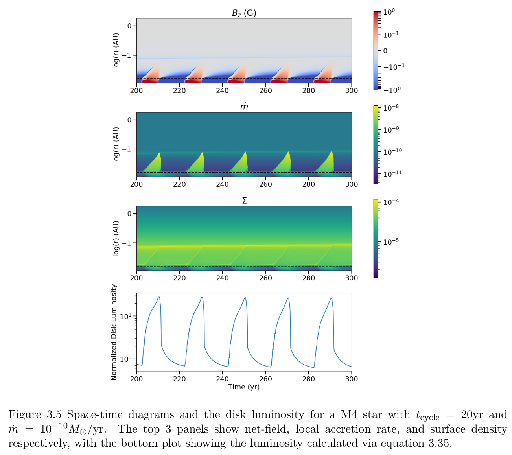
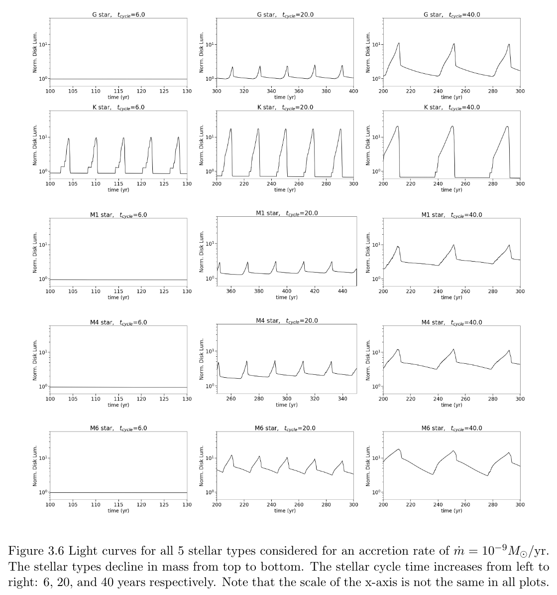

# netFieldEvoV2

This code evolves the net-magnetic-flux and surface density of an accretion disk while self-consistently solving a static disk model at each point in time.  For a full description of the model and it's implementation, see chapter 3 of my thesis work: https://dgole.github.io/pages/thesis.html.   

# Organization
fmatrix: Contains grid geometry files and tables of pre-calculated geometry terms (the "f matricies").  

mathematica: Contians code to set up grids and calculate the f matricies.  Also contains lots of random notebooks plotting and calculating various disk models.  

python: The python code-base to run the model and plot the results.  

scripts_run: Scripts (bash) that run the models.  

scripts_analysis: Scripts (bash and python) that make plots.  

# Typical Useage
1. Go into ./scripts_run/ and make a copy of the example run script.  
2. Edit the run script to have the desired parameters.  
3. Run the scipt and wait.  The code will give a time estimate as it runs.  When the model finishes running, an output directory will be created at ./output/run????/ and will have the output files saved to it.  
4. Generate plots based on the model you ran.  Start with ./scripts_analysis/plots_standard.py, which takes one command line argument: the ID number of the run.  This script will save a handful of useful plots to the same output folder.    

# Example Plots
Multi-panel space-time plot:  
  

Array of light curves for various disk/star parameters:  
  
